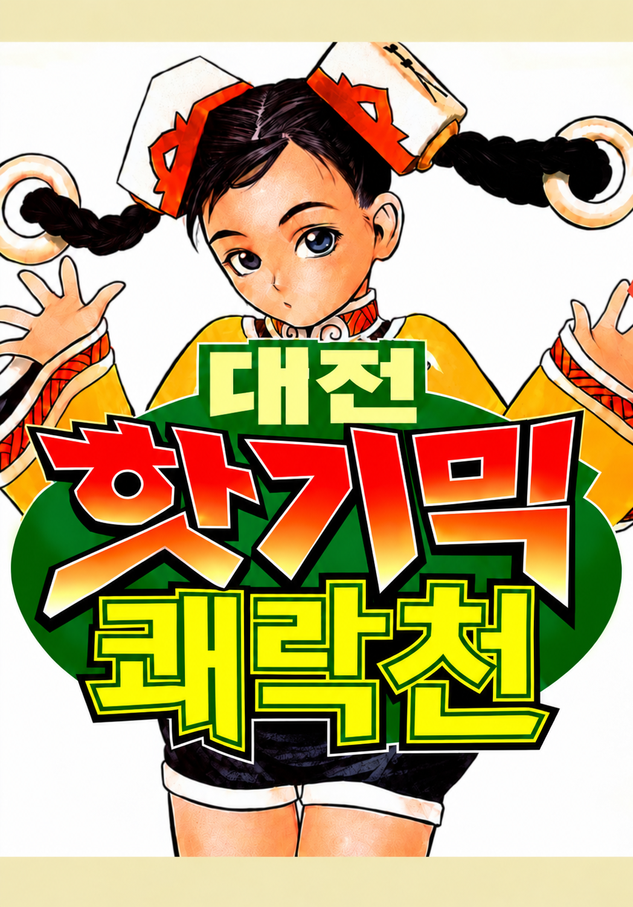

# 대전 핫 기믹 쾌락천 (Taisen Hot Gimmick Kairakuten) 한글 패치

<p align="center"></p>

## 게임 소개

**대전 핫 기믹 쾌락천**(対戦ホットギミック 快楽天)은 사이쿄(Psikyo)가 1998년에 내놓은 아케이드 2인 마작 게임으로, [대전 핫 기믹](https://github.com/stPark-dev/Taisen_Hot_Gimmick_Korean)의 후속작입니다.

- **줄거리**: 만화 세계에 갇힌 주인공이 도우미 강아지와 함께 세계의 출구를 찾아다닙니다. 출구를 아는 듯한 아가씨들에게 물어보면, 대답 대신 마작 승부가 시작됩니다.
- **상대**: 사장 비서, 별의 공주님, 격투 클럽 소녀, 전업주부, 메카 메이드, 흑마술 소녀, 만화가, 수상한 알몸 사무라이, 전작의 코요미·밀리언 등 15명.
- **벌칙**: 이기면 버튼 연타로 즐기는 벌칙 미니게임이 이어집니다.
- **도우미 강아지**: 플레이어를 "두목"이라 부르며 작파워 기술(패 바꾸기, 쌓기, 일발 리치)과 작푸드를 챙겨 줍니다.

이 저장소는 이 게임(MAME 세트 `hgkairak`)의 한글화 도구와 번역 데이터입니다. 원본 ROM은 들어 있지 않고, 가지고 있는 원본 ROM으로 한글판 ROM을 만들어 줍니다.

## 버전

| 버전 | 의미 |
|---|---|
| **v1.0** | **정식판**. 모든 대사·그림 글자가 사람 검수를 통과하고(`distribution_eligible`), `--policy release` 빌드가 성공하는 첫 버전 |
| v0.x | 개발판. 검수 전 번역이 들어 있으며 빌드 결과물에 `"distribution": false`가 기록됨 |

**현재 버전: v0.1.0 (초벌 개발판)** — 버전 번호의 기준은 [`VERSION`](VERSION) 파일입니다.

v0.1.0에 들어 있는 것:

- 대사·안내·메뉴·역 이름·테스트 모드 문자열 686개 전체 (초벌 번역 + 독립 2차 검토 반영). 전작과 원문이 같은 242개는 전작 번역을 그대로 사용
- 타이틀 로고: 제공 이미지로 원래의 등장 연출(19프레임)을 한글로 다시 만듦
- 그림 글자: 대국 말풍선 107개, 코인 문구 3종, 컨티뉴 화면 문구, 모드 선택 사진 글자(통신 대전 / 1인 플레이)
- 한글 글꼴: 나눔고딕 15px (대사), 나눔고딕 ExtraBold·나눔명조 ExtraBold (그림 글자)

v1.0까지 남은 일:

- 사람 검수: 대사 686개, 그림 글자 111개가 모두 `needs_review` 상태
- 아직 처리하지 않은 그림 글자: 상대 후보 이름표(한자 이름), 스태프 크레딧, 대국 화면 표시(東場, ツモ 패 표시 등), 벌칙·엔딩·2대 연결 대전 화면의 글자 — 목록은 [`docs/initial-survey.md`](docs/initial-survey.md) 4.3절

## 준비물

- Python 3.11 이상, [Pillow](https://pypi.org/project/Pillow/) 9.4 이상, NumPy, pytest (테스트용). 로고 층을 다시 만들 때만 SciPy
- 나눔 글꼴 (`/usr/share/fonts/truetype/nanum/`, 데비안 `fonts-nanum`)
- MAME (0.289에서 확인). 데비안에서는 `flatpak install --user flathub org.mamedev.MAME`
- 원본 ROM `hgkairak.zip` — MAME 0.289 기준 `romset hgkairak is good`인 세트. 파일별 크기·SHA1은 [`tools/hgkairak/source.py`](tools/hgkairak/source.py)에 있고, 다르면 빌드가 거부합니다.

## 사용법

```sh
# 1. 한글판 ROM 만들기 → out/hgkairak.zip, out/manifest.json
python3 tools/khpatch.py build --source /경로/hgkairak.zip

# 2. 실행 (MAME Flatpak, 1P 화면만 표시)
./run_ko.sh              # 한글판
./run.sh                 # 원본 (roms/hgkairak.zip)
./run_ko.sh -view "Left-to-Right"   # 1P/2P 두 화면

# 3. 테스트
python3 -m pytest -q tests
```

번역문을 고친 뒤에는 `build`만 다시 실행하면 됩니다. 원본 ROM이 바뀌었거나 추출 규칙을 바꿨다면 먼저 `python3 tools/khpatch.py extract --source hgkairak.zip`으로 번역 표를 다시 맞춥니다(기존 번역은 유지되고, 원문이 달라진 항목은 오류로 알려 줍니다).

조작 (MAME 기본 키): 코인 `5`, 1P 스타트 `1`, 패 선택 `A`~`N`, 론 `Z`, 쯔모 `N`, 깡 `Left Ctrl`, 퐁 `Left Alt`, 치 `Space`, 리치 `Left Shift`.

## 번역 데이터

| 파일 | 내용 |
|---|---|
| [`translation/dialogue.json`](translation/dialogue.json) | 대사 686개. 원문 코드·원문·칸 수·용량(보호 필드)과 번역 `ko`·상태 `state`·메모 `note` |
| [`translation/graphics_text.json`](translation/graphics_text.json) | 그림 글자 111개. 서식 표 주소·스타일·원문(화면에서 옮겨 적음)·번역·상태 |
| [`translation/glossary.json`](translation/glossary.json) | 용어·말투 결정 (전작에서 승인된 것은 그대로 승계, 이번 작품 캐릭터 이름 등은 proposed) |

번역문 규칙 (전작과 같음):

- 대사의 줄바꿈은 `\n`, 공백은 16px 한 칸을 차지합니다. 문장부호 뒤에는 공백을 넣지 않습니다(칸 절약 규칙).
- 문자열마다 원문 줄 수와 가장 긴 줄의 칸 수를 넘을 수 없고, 넘치면 빌드가 실패합니다.
- 반각 `!?,.~-` 등은 자동으로 전각 글꼴 글자로 바뀝니다. 글꼴에 없는 글자는 빌드 실패입니다.
- 상태: `untranslated` → `in_progress` → `needs_review` → `needs_human_review` → `distribution_eligible`
- 포인터가 가리키지 않는 문자열 225개(메모 "포인터 미참조")는 게임이 쓰지 않는 것으로 보이지만 모두 번역해 두었습니다.

## 구조

```
tools/khpatch.py              진입점 (extract / build)
tools/derive_title_layers.py  제공 로고 이미지 → 타이틀 연출용 3개 층 (자산 준비용, 빌드와 별개)
tools/hgkairak/source.py      지원 원본 ROM 프로필 (크기·SHA1)
tools/hgkairak/layout.py      CPU/그래픽 영역 ↔ ROM 칩 파일 좌표 변환
tools/hgkairak/charmap.py     원본 글리프 코드표, 한글 슬롯 배정
tools/hgkairak/textblock.py   대사 블록 파싱·레이아웃·인코딩
tools/hgkairak/graphics.py    그림 글자 합성 (팔레트 근사, 말풍선, 인페인트 등)
tools/hgkairak/title.py       타이틀 로고 연출 재구성 (19프레임 합성, 타일 재배치, 배치표 재작성)
tools/hgkairak/writeplan.py   쓰기 계획: 원본 기대값 검증, 겹침·설명 안 되는 변경 거부, 전부 아니면 전무
tools/hgkairak/build.py       추출과 제품 빌드
tests/                        계약 테스트 (가짜 ROM 세트로 빌드 전 과정 포함)
docs/initial-survey.md        분석 결과: ROM 구조, 대사 엔진, 타이틀 스트립, 그림 글자 목록, 사람 결정 기록
```

빌드는 원본 17개 파일의 SHA1을 확인한 뒤, 모든 변경을 원본 기대 바이트가 붙은 쓰기 계획으로 등록하고, 겹침·기대값·최종 차이를 검사한 다음 한 번에 적용합니다.

## 권리

- 이 저장소에는 원본 ROM이나 원본에서 뽑아낸 그래픽·글꼴 덤프가 들어 있지 않습니다. 번역 표에는 원본 대사 문자열과 코드가 들어 있습니다(재삽입에 필요).
- 원작 게임의 권리는 권리자에게 있습니다. 합법적으로 가진 ROM에만 적용하세요.
- 나눔 글꼴은 SIL Open Font License입니다(저장소에 포함하지 않고 시스템 글꼴을 사용).
- `assets/gfx/title_ko.png`는 프로젝트 소유자가 제공한 한글 로고 이미지이고, `assets/gfx/title_layer_*.png`는 그 이미지에서 만든 층입니다. 배포 전에 이용 권리를 확인해야 합니다.
- `docs/poster.png`는 프로젝트 소유자가 제공한 한글판 포스터 이미지입니다(원작 캐릭터 그림 포함). 배포 전에 이용 권리를 확인해야 합니다.
